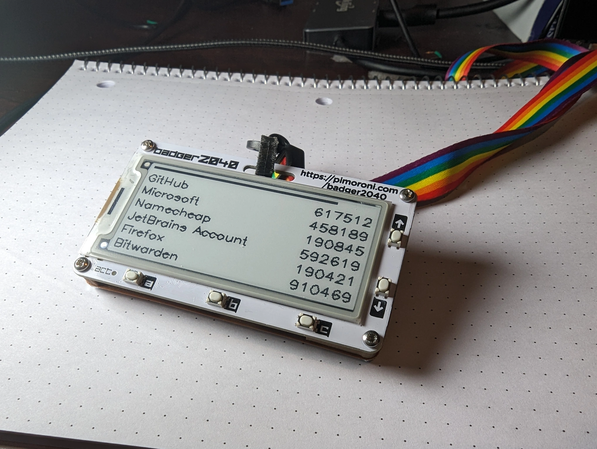
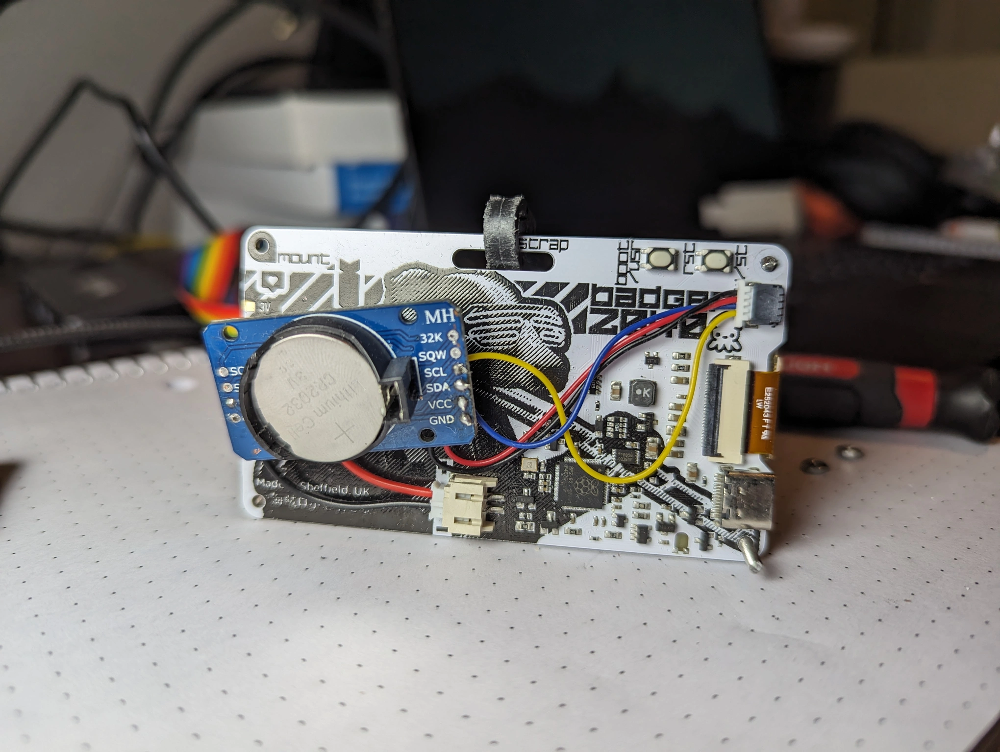
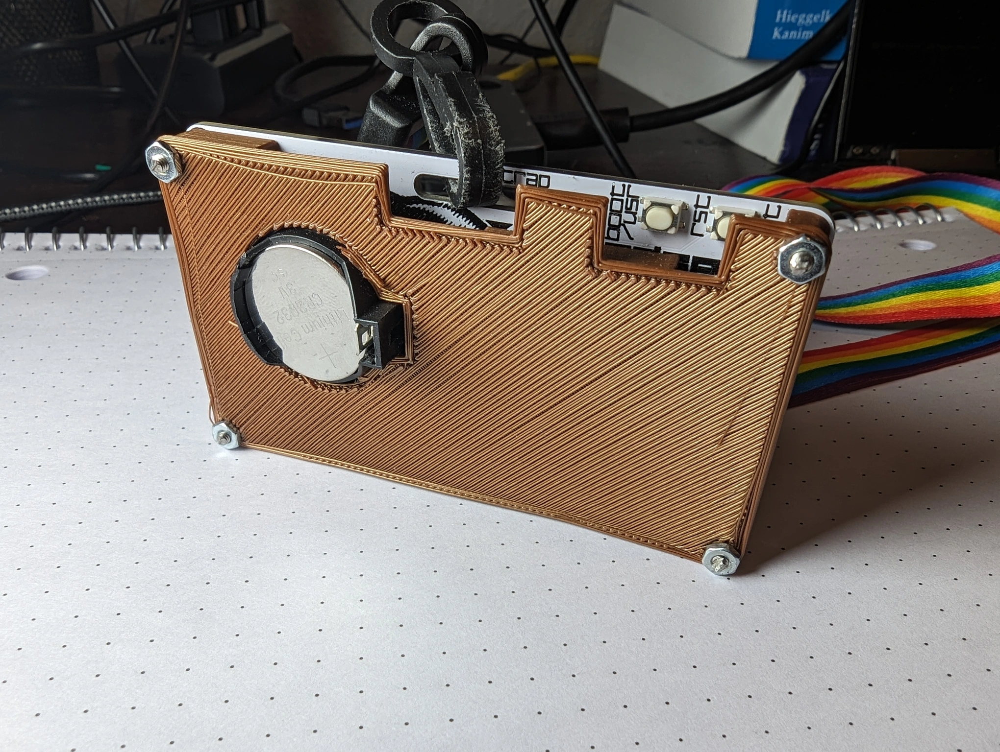

# Karmanyaah's AirGapped TOTP v2

Isn't keeping your 2FA codes connected to the internet kinda insecure? In today's episode of let's overcomplicate established procedures for marginal security improvements, I[\*](#acknowledgements) made an e-ink based, battery operated TOTP device.

It uses Pimoroni's Badger2040 board, which is an awesome PCB that integrates an E-ink display and RP2040 microcontroller. 

On the back, there's a DS3231 with wires soldered to it, going to the JST-?? for I2C and JST-PH battery connector. And I designed a case to protect the wiring.

Demo: <https://www.youtube.com/watch?v=7Y9NhbLoITg>

The UX code is in the second half of `totp/__init__.py`. If you connect to the Badger using `rshell` or `thonny`, you can run `set_time.py` to save your computer's time to the RTC.

So why did this simple take me 2 years and 11 months to finish? Well, the lack of access to a 3D printer and letting perfect be the enemy of progress. While the badger is an inconvinient form factor for this task - something keychain sized would totally work - I have been using it since I printed the case at school in April and it was easy to build and works just fine. I spent a whole bunch of time on [this v1](https://www.youtube.com/watch?v=-DAnVcRW7Qk), but just gave up because it was too much of a pain to build.

But, this project is still not finished. To achieve my ideal form factor, I'm planning on building v3 with a [Game&Light wrist watch](https://hackaday.io/project/184703-gamelight-a-keychain-size-game-console-with-a-led) inspired custom PCB. More to come soonTM.

## Notes

- This was made before the Badger2040 W was released. I know that's a board with an RTC integrated, but this code doesn't work with that out of the box.

## Acknowledgements

This project simply packages a bunch of different people's projects together. Huge thanks to:
- Pimoroni for the Badger2040, BadgerOS, and associated e-ink libraries.
- [Edd Mann's Pico 2FA TOTP](https://github.com/eddmann/pico-2fa-totp) library for doing all the actual TOTP computations in MicroPython in `./totp/`.
- [Peter Hinch's DS3231 Driver](https://github.com/peterhinch/micropython-samples/blob/master/DS3231/ds3231_port.py) in `./rtc.py`.
- My 3D Printed case was inspired by <https://www.thingiverse.com/thing:5997974> and <https://www.thingiverse.com/thing:5271558> and used [this DS3231 model](https://grabcad.com/library/hw-84-ds3231-real-time-clock-1) for sizing.
